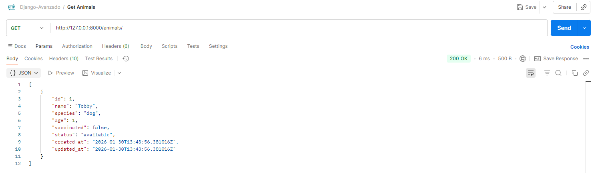
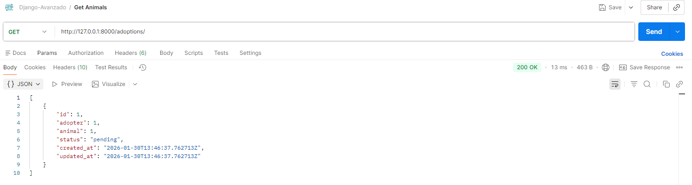

# Django Avanzado (Refugio de animales)
## Introducción 
En este proyecto se ha desarrollado una API Rest utilizando Django y Django REST Framework para la gestión de un refugio de animales. La aplicación permite administrar animales, adoptantes y solicitudes de adopción, aplicando un sistema de autenticación y permisos para controlar a las distintas funcionalidades.

El sistema utiliza MySQL como base de datos y hace uso de vistas genéricas, ViewSets y una vista personalizada que enlaza varios modelos, cumpliendo así los requisitos establecidos.

## Lógica del sistema
El proyecto se basa en la gestión de un *refugio de animales*, donde existen tres entidades principales :
- Animales
- Adoptantes
- Solicitudes de adopcion

### Animales
Los animales representran a los animales disponibles del refugio.
Cada animal contiene información básica como su nombre, edad, estado de vacunación y estado de adopción.

Un animal puede encontrarse en diferentes estados:

- available: el animal está disponible para ser adoptado
- reserved: el animal tiene una solicitud fr adopción pendiente 

Un mismo animal puede tener varias solicitudes de adopción, pero solo peude estar disponible mientras su estado sea available

### Adoptantes
Los adoptantes representan a las personas interesadas en adoptar un animal.
Un adoptante puede realizar una o varias solicitudes de adopción, siempre asociadas a animales existentes en el sistema.

### Solicitudes de adopción 
Las solicitudes de adopción representan la relación entre un animal y un adoptante.l
Cada solicitud enlaza directamente ambos modelos y permite registrar el interes de un adoptante por un animal concreto.

Cuando se crea una solicitud de adopción:
- Se genera una nueva entrada en el modelo de solicitudes.
- El estado del animal cambia automáticamente de available a reserved

### Usuarios, permisos y roles
El sistema incluye un control de acceso basado en ususarios y grupos:
#### Staff del refugio (staff_refugio)
Este grupo representa al personal del refugio y tiene permisos completos para:
- Crear, modificar y eliminar animales
- Gestionar adoptantes.
- Gestionar solicitudes de adopción

Captura 

#### Visitantes (visitantes)
Este grupo representa a usuarios externos o visitantes del sistema.
- Pueden consultar la información disponible (lectura)
No tienen permisos para crear , modificar o eliminar datos

Captura

## Tecnologías utilizadas
- Python
- Django
- Django Rest Framework
- MySQL
- DBeaver
- Postman
- Github

## Creación y configuración inicial
### Creación del entorno virtual e instalación de dependencias
```cmd
python -m venv .venv
.venv\Scripts\activate
pip install django djangorestframework mysqlclient
```
### Creación del proyecto y aplicaciones
Una vez configurado el entorno, se creó el proyecto principal y las aplicaciones necesarias para la gestión del sistema.

```cmd
django-admin startproject api_server .
python manage.py startapp animals
python manage.py startapp adopters
python manage.py startapp adoptions
```

Posteriormente las aplicaciones fueron registradas en el archivo settings.py para que Django pudiera reconocerlas.

### Configuración de la abse de datos MySQL
Para la persistencia de los datos se utilizó MySQL como sistema gestor de bases de datos. La base de datos fue creada manualmente mediante la herramienta Dbeaver, junto con un ususario específico para el proyecto

```sql
CREATE DATABASE refugio_db;
CREATE USER 'django_user'@'localhost' IDENTIFIED BY 'password';
GRANT ALL PRIVILEGES ON refugio_db.* TO 'django_user'@'localhost';
FLUSH PRIVILEGES;
```

La conexión con MySQL se configuró en el archivo settings.py del proyecto:
```python
DATABASES = {
    'default': {
        'ENGINE': 'django.db.backends.mysql',
        'NAME': 'refugio_db',
        'USER': 'django_user',
        'PASSWORD': 'password',
        'HOST': 'localhost',
        'PORT': '3306',
    }
}
```

### Migraciones y creación del administrador
Tras la configuración de la abse de datos, se ejecutaron las migraciones para crear las tablas correspondientes a los modelos definidos en el proyecto y se creó un usuario administrador para acceder al panel de administración de Django.

```cmd
python manage.py makemigrations
python manage.py migrate
python manage.py createsuperuser
```
## Vistas genéricas y pruebas de funcionamiento
Para la implementación de la API se utilizaron vistas genéricas de Django REST Framework, aplicadas a los modelos Animal y AdoptionRequest. Estas vistas permiten gestionar de forma clara y estructurada las operaciones CRUD del sistema.
cada operación fue probada mediante la herramienta Postman, comprobando el correcto funcionamiento.

### Operaciones implementadas mediante vistas genéricas
Las vistas genéricas utilizadas en el proyecto fueron las siguientes:
- ListAPIView: Listar todos los registros
- CreateAPIView: crear nuevos registros
- RetrieveAPIView: obtener el detalle de un registro concreto
- UpdateAPIView: actualizar un registro existente.
- DestroyAPIView: eliminar un registro
Estas vistas se implementaron para los modelos Animal y AdoptionRequest

### Pruebas de listado (GET)
Se comprobó el correcto funcionamiento de las vistas de listado accediendo a los endpoints correspondientes sin necesidad de autenticación. Estas peticiones permiten consultar la información disponible en el sistema.

Captura de Postman – GET /animals/


Captura de Postman – GET /adoptions/



Resultado esperado:
- Respuesta con código 200 OK
- Devolución de un listado en formato JSON

### Pruebas de creación (POST)
Las operaciones de creación se probaron utilizando autenticación por token, verificando que solo los ususarios con permisos adecuados pueden crear nuevos registros.


Captura de Postman – POST /animals/create/ con token válido
Captura de Postman – POST /adoptions/create/ con token válido

Resultado esperado:
- Respuesta con código 201 Created
- Registro creado correctamente en la base de datos

### Pruebas consulta individual (GET por id)
Se comprobó la obtención del detalle de un registro concreto utilizando su identificador

Captura de Postman – GET /animals/{id}/


Resultado esperado:
- Respuesta con código 200 OK
- Información detallada del animal solicitado